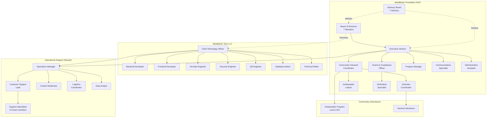

# 📊 MeetBarter Organizational Structure

## Institutional Framework

MeetBarter operates through a **dual-entity structure** designed for resilience, legal compliance, and mission alignment:

1. **MeetBarter Tech LLC (S.A.L)** - Technical development and IP ownership
2. **MeetBarter Foundation NGO** - Community governance and social mission

---

## Complete Organizational Chart

---

## Entity Breakdown

### MeetBarter Foundation NGO

**Legal Status:** Registered Lebanese NGO  
**Purpose:** Social mission, community governance, grant distribution  
**Governance:** Board of Directors (7 members)  
**Staff:** ~10-15 employees  
**Funding:** Donations, grants, platform fees (15%)

**Key Functions:**

- Community programs and outreach
- Grant distribution (Community Grant Program)
- Regulatory compliance and reporting
- Ambassador program management
- User advocacy and protection

---

### MeetBarter Tech LLC (S.A.L)

**Legal Status:** Lebanese Limited Liability Company  
**Purpose:** Software development, IP ownership, technical infrastructure  
**Governance:** LLC Board (may overlap with NGO Board)  
**Staff:** ~8-12 employees  
**Funding:** Equity investment, SAFT agreements, service fees

**Key Functions:**

- Platform development and maintenance
- Cybersecurity and data protection
- Master Key custody and rotation
- Protocol 0 (Kill Switch) authority
- Technical infrastructure (99.9% uptime)

---

### Operational Support (Shared Services)

**Legal Status:** Employees of NGO, services provided to both entities  
**Purpose:** Day-to-day operations, user support, moderation  
**Management:** Reports to both ED (NGO) and CTO (LLC)  
**Staff:** ~8-12 employees  
**Funding:** Shared cost allocation between NGO and LLC

**Key Functions:**

- Customer support and helpdesk
- Content moderation and trust & safety
- Logistics coordination
- Data analysis and reporting
- Verification processing

---

## Total Team Size

| Entity | Core Team | Support Staff | Total |
|--------|-----------|---------------|-------|
| NGO | 7-10 | 5-8 volunteers | 12-18 |
| LLC | 8-12 | - | 8-12 |
| Shared Ops | 8-12 | - | 8-12 |
| **Total** | **23-34** | **5-8** | **28-42** |

**Plus:**

- 7 Board Members (volunteer)
- 7 Advisory Board Members (part-time)
- 50-200 Ambassadors (community volunteers)
- 100-500 General Volunteers

---

## Reporting Structure

### Board of Directors (NGO)

- **Chairperson** - Strategic oversight
- **Vice President** - Operational oversight
- **Treasurer** - Financial oversight
- **Secretary** - Records and compliance
- **Legal Advisor** - Legal compliance
- **Community Representative** - User advocacy
- **Technical Oversight Director** - Technical governance

### Executive Leadership

- **Executive Director (NGO)** - Reports to Board
- **CTO (LLC)** - Reports to LLC Board and NGO Technical Director
- **Operations Manager (Shared)** - Reports to ED and CTO

### Advisory Board (NGO)

- Economic Development Advisor
- Technology & Cybersecurity Advisor
- Legal & Regulatory Advisor
- Social Impact Advisor
- Financial & Investment Advisor
- Marketing & Communications Advisor
- International Development Advisor

---

## Cross-Entity Coordination

### Weekly Sync

- ED + CTO + Operations Manager
- Alignment on priorities and issues

### Monthly All-Hands

- All staff from NGO, LLC, and Ops
- Updates, celebrations, Q&A

### Quarterly Board Meetings

- NGO Board + CTO (invited)
- Strategic review and planning

### Annual Retreat

- Board + Leadership + Advisors
- Long-term vision and planning

---

## Decision-Making Authority

| Decision Type | Authority | Approval Required |
|---------------|-----------|-------------------|
| Daily Operations | Operations Manager | None |
| Technical Features | CTO | None (within roadmap) |
| Program Initiatives | Executive Director | Board (for budget >$5K) |
| Budget Allocation | Treasurer + ED | Board (annual budget) |
| Master Key Rotation | CTO | Board + Security Codes |
| Protocol 0 Activation | Chairperson + CTO | 2/3 Board Vote |
| Bylaw Amendments | Board Secretary | 2/3 Board Vote |
| Major Partnerships | Chairperson + ED | Simple Board Majority |

---

## Compensation Philosophy

### NGO Staff

- Competitive nonprofit sector salaries
- Mission-driven culture
- Professional development support
- Work-life balance emphasis

### LLC Staff

- Competitive tech sector salaries
- Non-voting equity stakes (Phase 0)
- Performance bonuses
- Remote work flexibility

### Shared Ops

- Hybrid compensation model
- Allocated between NGO and LLC budgets
- Benefits from both entities

### Volunteers & Ambassadors

- VP rewards and recognition
- No monetary compensation
- Professional development opportunities
- Community impact

---

## Growth Roadmap

### Phase 0 (Current): Bootstrap

- Minimal viable team
- Founder-led operations
- Volunteer-heavy model

### Phase 1 (Year 1): Foundation

- Hire core NGO and LLC teams
- Establish operational processes
- Scale Ambassador program to 50+

### Phase 2 (Year 2-3): Scale

- Expand to 30-40 full-time staff
- Regional expansion (Lebanon → MENA)
- Professionalize all functions

### Phase 3 (Year 4+): Maturity

- 50+ staff across multiple countries
- Self-sustaining operations
- International NGO partnerships

---

*Property of MeetBarter Foundation NGO & Meetbarter Tech LLC*
